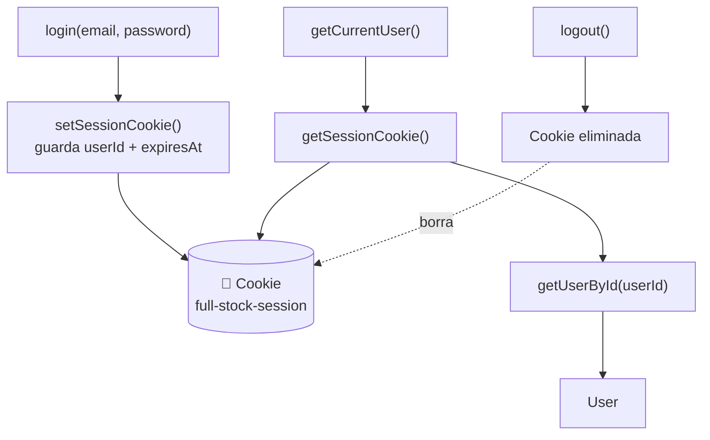

# Step 11 — Login Session Persistence

## Descripción

El login del paso anterior funcionaba pero no recordaba al usuario al navegar entre páginas. En este paso se añade la **persistencia de sesión** usando una cookie del navegador.

La cadena de responsabilidad ahora es:



### Explicación del Flujo de Sesión

El diagrama ilustra los tres momentos clave del ciclo de vida de una sesión, que operan en paralelo sin bloquearse mutuamente:

1. **El Flujo de Autenticación (`login`):**
   Cuando un usuario introduce sus credenciales correctamente, `login` ya no solo retorna los datos en memoria. Antes de terminar, llama internamente a `setSessionCookie()`. Esta función empaqueta el `userId` y el tiempo de expiración (`expiresAt`), y los almacena físicamente en el navegador como una cookie (`full-stock-session`).

2. **El Flujo de Recuperación (`getCurrentUser`):**
   Esta es la función más importante para la persistencia. Se ejecuta cada vez que se carga la aplicación (ej. cuando el usuario presiona F5 o abre una pestaña nueva).
   - Primero, llama a `getSessionCookie()` para leer el navegador y ver si la cookie existe.
   - Si la encuentra y no está expirada, extrae el `userId`.
   - Con ese `userId`, llama a `getUserById(userId)` para ir a la base de datos (nuestro array en memoria) y traer el objeto `User` completo. Así la interfaz puede mostrar "Hola, demo@fullstock.com" sin obligar al usuario a volver a teclear su contraseña.

3. **El Flujo de Cierre (`logout`):**
   Es la operación más sencilla. Para destruir la sesión, `logout()` simplemente le ordena al navegador sobreescribir la cookie `full-stock-session` dándole un tiempo de vida nulo (`max-age=0`). El navegador la destruye inmediatamente.

### Archivos modificados

| Archivo | Cambio |
|---|---|
| `src/services/user.service.ts` | Se añadió `getUserById()`, necesaria para que `getCurrentUser()` pueda reconstruir el usuario desde el `userId` guardado en la cookie. |
| `src/services/auth.service.ts` | Se añadieron `getSessionCookie()`, `setSessionCookie()`, `getCurrentUser()` y `logout()`. La función `login()` ahora llama a `setSessionCookie()` al autenticar exitosamente. |
| `src/routes/login/index.tsx` | En lugar de mostrar un mensaje inline, ahora redirige a `/` tras el login exitoso con `useNavigate`. |
| `src/routes/root/index.tsx` | El layout llama a `getCurrentUser()` al montarse. Si hay sesión activa muestra el email y un botón de logout. Si no, muestra un enlace a `/login`. |

### Cómo funciona la cookie de sesión

Al hacer login con éxito, se guarda una cookie con este formato:

```json
{ "userId": 1, "expiresAt": 1716000000000 }
```

- `userId` — identifica qué usuario está autenticado.
- `expiresAt` — timestamp en milisegundos. Si la fecha actual supera este valor, la sesión se considera expirada y `getCurrentUser()` devuelve `null`.

La cookie tiene un `max-age` de 24 horas. El navegador la borra automáticamente cuando expira.

### Por qué Root lee la sesión

`Root` es el layout compartido de todas las rutas. Es el lugar correcto para leer la sesión porque se monta una sola vez y su `<nav>` está siempre visible. Si el usuario navega entre páginas, la sesión ya fue leída y el estado está en memoria.
